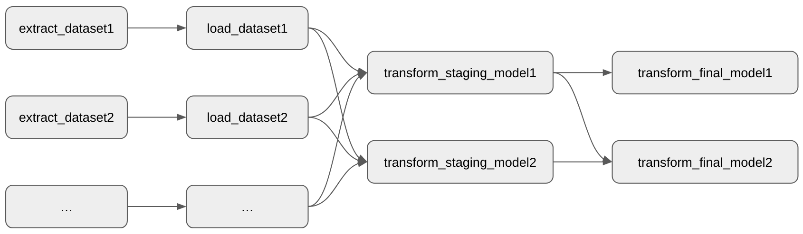

**Contents:**
* [Git/GitHub](#gitgithub)
  * [Collaborating on a Repository](#collaborating-on-a-repository)
  * [Resolving Merge Conflicts](#resolving-merge-conflicts)
  * [Excellent Guides to Git](#excellent-guides-to-git)
* [Extracting, Transforming, and Loading Data](#extracting-transforming-and-loading-data)
  * [Setting up your folder structure](#setting-up-your-folder-structure)
  * [Setting up your environment for development](#setting-up-your-environment-for-development)
  * [Running a script in your local environment](#running-a-script-in-your-local-environment)
  * [Writing an extract module](#writing-an-extract-module)
  * [Writing a load module for non-geospatial data](#writing-a-load-module-for-non-geospatial-data)
  * [Writing a load module for geospatial data](#writing-a-load-module-for-geospatial-data)
  * [Writing an Airflow DAG for a pipeline](#writing-an-Airflow-DAG-for-a-pipeline)
* [Mapping in JS](#mapping-in-js)
  * [Put a Leaflet map on a page](#put-a-leaflet-map-on-a-page)
  * [Use a different base layer](#use-a-different-base-layer)
  * [Add a GeoJSON-formatted data layer](#add-a-geojson-formatted-data-layer)
  * [Add multiple GeoJSON layers with a toggle control](#add-multiple-geojson-layers-with-a-toggle-control)
  * [Style GeoJSON data based on data parameters](#style-geojson-data-based-on-data-parameters)
    * [Color features by discrete category values](#color-features-by-discrete-category-values)
    * [Color features by a continuous value](#color-features-by-a-continuous-value)
* [Charts in JS](#charts-in-js)
  * [Put a C3 chart on a page](#put-a-c3-chart-on-a-page)
  * [Other Types of C3 Charts](#other-types-of-c3-charts)
    * [Timeseries](#timeseries)

## Git/GitHub

### Collaborating on a Repository

Collaborating with git can be simple. You do not need to worry about branching, code reviews, pull requests, etc. if you are just working with a small group on a personal project.

1. [Create a repository](https://docs.github.com/en/repositories/creating-and-managing-repositories/creating-a-new-repository) on one group member's account.
2. Invite other group members as [collaborators](https://docs.github.com/en/account-and-profile/setting-up-and-managing-your-github-user-account/managing-access-to-your-personal-repositories/inviting-collaborators-to-a-personal-repository) to the repository.
3. [Clone the repository](https://docs.github.com/en/repositories/creating-and-managing-repositories/cloning-a-repository) to each group member's computer.
4. When you make changes to the code:
   * Commit frequently.
   * Try not to include too many changes in one git commit.
   * Pull/push your _working_ code frequently.
   * Always write a meaningful git commit message.
   Read [these tips for creating meaningful git commits](https://reflectoring.io/meaningful-commit-messages/).

### Resolving Merge Conflicts

Code conflicts will be minimized if you remember to:
* Commit frequently.
* Try not to include too many changes in one git commit.
* Pull/push your _working_ code frequently.

However, unavoidably, eventually there will be some lines in your code that conflict with a collaborator's. Don't panic, this is normal. Read this [Atlassian Guide to Git Merge Conflicts](https://www.atlassian.com/git/tutorials/using-branches/merge-conflicts) (or you can skip straight to the sections on [identifying and resolving conflicts](https://www.atlassian.com/git/tutorials/using-branches/merge-conflicts#:~:text=How%20to%20identify%20merge%20conflicts)).

### Excellent Guides to Git

* [Beanstalk Guides](http://guides.beanstalkapp.com)
* [Atlassian Git Tutorials](https://www.atlassian.com/git/tutorials)
* [GitHub Guides Quickstart](https://docs.github.com/en/get-started/quickstart)
* [Git Cheatsheet](https://education.github.com/git-cheat-sheet-education.pdf) (it's dense)
* **And, for when you're in a bind: [Git happens! 6 Common Git mistakes and how to fix them](https://about.gitlab.com/blog/2018/08/08/git-happens/)**

## Extracting, Transforming, and Loading Data

### Setting up your folder structure

```
📂 airflow
  📂 dags
    📂 data_pipeline
      📂 sql
        📂 staging
          📄 transformed_staging_model1.sql
          📄 transformed_staging_model2.sql
        📂 final
          📄 transformed_final_model1.sql
          📄 transformed_final_model2.sql
      📄 __init__.py
      📄 extract_dataset1.py
      📄 extract_dataset2.py
      📄 load_dataset1.py
      📄 load_dataset2.py
  📂 plugins
    📄 pipeline_tools.py
```

The **dags/** folder is where all your DAGs live. In the example above, the name of the **data_pipeline/** folder is arbitrary -- we could name it anything.

The **plugins/** folder folder contains all the code that might be used across multiple DAGs.

### Setting up your environment for development

I recommend you use either **conda** or **poetry** to manage your environment. The following packages should probably be added to your environment:
* pandas
* geopandas
* pandas-gbq
* google-cloud-storage
* google-cloud-bigquery-storage
* jinja2

When you're working on your project, activate your environment in a shell:

_conda:_
```bash
conda activate YOUR_ENVIRONMENT_NAME
```

_poetry:_ (from within your project folder...)
```bash
poetry shell
```

### Running a script in your local environment

For all of your pipeline scripts, you should have a `GOOGLE_APPLICATION_CREDENTIALS` environment variable set. There are many ways you can do this. Here are a few:

* _conda:_
  ```bash
  conda env config vars set GOOGLE_APPLICATION_CREDENTIALS="PATH TO KEY FILE GOES HERE"
  ```

* _poetry:_
  ```bash
  poetry add python-dotenv[cli]
  echo "GOOGLE_APPLICATION_CREDENTIALS='PATH TO KEY FILE GOES HERE'" >> .env
  ```

* In a _Jupyter Notebook:_ (add the following to a cell)
  ```python
  import os
  os.environ['GOOGLE_APPLICATION_CREDENTIALS'] = 'PATH TO KEY FILE GOES HERE'
  ```

To run a script locally, for testing/debugging purposes, if you are in the root folder of your project in your terminal, e.g.:

```bash
python airflow/dags/data_pipeline/extract_dataset1.py
```

> **If you're using a _.env_ file for your environment variables, prefix your commands with `dotenv run`.**

### Writing an **extract** module

```python
from pipeline_tools import http_to_gcs

DATA_URL = '...'  # <-- The URL where the data comes from
BUCKET_NAME = '...'  # <-- The name of the Google Cloud Storage bucket
DATA_PATH = '...'  # <-- Where the file will be stored in the bucket

def main():
    http_to_gcs(
        request_method='get',
        request_url=DATA_URL,
        gcs_bucket_name=BUCKET_NAME,
        gcs_blob_name=DATA_PATH.format(ds=ds),
    )

if __name__ == '__main__':
    main()
```

### Writing a **load** module for non-geospatial data

```python
from pipeline_tools import gcs_to_local_file, geopandas_to_gbq
import pandas as pd

# Google Cloud Storage information
BUCKET_NAME = '...'
DATA_PATH = '...'

# Google BigQuery information
DATASET_NAME = '...'
TABLE_NAME = '...'

def main():
    local_path = gcs_to_local_file(
        gcs_bucket_name=BUCKET_NAME,
        gcs_blob_name=DATA_PATH,
    )
    df = pd.read_csv(local_path)
    df.to_gbq(f'{DATASET_NAME}.{TABLE_NAME}')

if __name__ == '__main__':
    main()
```

### Writing a **load** module for geospatial data

```python
from pipeline_tools import gcs_to_local_file, geopandas_to_gbq
import geopandas as gpd

# Google Cloud Storage information
BUCKET_NAME = '...'
DATA_PATH = '...'

# Google BigQuery information
DATASET_NAME = '...'
TABLE_NAME = '...'

def main():
    local_path = gcs_to_local_file(
        gcs_bucket_name=BUCKET_NAME,
        gcs_blob_name=DATA_PATH,
    )
    gdf = gpd.read_file(local_path)
    geopandas_to_gbq(
        geodataframe=gdf,
        dataset_name=DATASET_NAME,
        table_name=TABLE_NAME,
    )

if __name__ == '__main__':
    main()
```

### Writing an Airflow DAG for a pipeline

```python
from airflow import DAG
from airflow.operators.python import PythonOperator
from datetime import datetime

from . import extract_dataset1
from . import extract_dataset2
...
from . import load_dataset1
from . import load_dataset2
...

with DAG(dag_id='data_pipeline',
         schedule_interval='@monthly',
         start_date=datetime(2021, 10, 22),
         catchup=False) as dag:

    extract_dataset1 = PythonOperator(
        task_id='extract_dataset1',
        python_callable=extract_dataset1.main,
    )

    extract_dataset2 = PythonOperator(
        task_id='extract_dataset2',
        python_callable=extract_dataset2.main,
    )

    ...

    load_dataset1 = PythonOperator(
        task_id='load_dataset1',
        python_callable=load_dataset1.main,
    )

    load_dataset2 = PythonOperator(
        task_id='load_dataset2',
        python_callable=load_dataset2.main,
    )

    ...

    transform_staging_model1 = PythonOperator(
        task_id='transform_staging_model1',
        python_callable=run_transform_gbq,
        op_args=['staging', 'transformed_staging_model1', sql_dir]
    )

    transform_staging_model2 = PythonOperator(
        task_id='transform_staging_model2',
        python_callable=run_transform_gbq,
        op_args=['staging', 'transformed_staging_model2', sql_dir]
    )

    transform_final_model1 = PythonOperator(
        task_id='transform_final_model1',
        python_callable=run_transform_gbq,
        op_args=['final', 'transformed_final_model1', sql_dir]
    )

    transform_final_model2 = PythonOperator(
        task_id='transform_final_model2',
        python_callable=run_transform_gbq,
        op_args=['final', 'transformed_final_model2', sql_dir]
    )

    ...

    # There are a few ways you can set up dependencies between tasks.
    # When you say "A >> B", it means that task B depends on task A.
    extract_dataset1 >> load_dataset1
    extract_dataset2 >> load_dataset2

    # When you say "D << [A, B, C]" it means task D depends on each of
    # tasks A, B, and C.
    transform_staging_model1 << [extract_dataset1, extract_dataset2, ...]
    transform_staging_model2 << [extract_dataset1, extract_dataset2, ...]

    # It doesn't matter what order you specify dependencies, as long
    # as you specify them all.
    transform_staging_model1 >> transform_final_model1
    transform_staging_model1 >> transform_final_model2
    transform_staging_model2 >> transform_final_model2
```

The above DAG definition would result in dependency graph like the following:



## Mapping in JS

While there is a lot of depth to creating really fancy map visualizations, creating basic interactive maps in a web page is mostly copy-paste. Here are some snippets that will help:

### Put a Leaflet map on a page

In your head, add:
```html
<link rel="stylesheet" href="https://unpkg.com/leaflet@1.7.1/dist/leaflet.css"
 integrity="sha512-xodZBNTC5n17Xt2atTPuE1HxjVMSvLVW9ocqUKLsCC5CXdbqCmblAshOMAS6/keqq/sMZMZ19scR4PsZChSR7A=="
 crossorigin=""/>

<style>
  #map1 {
    height: 250px;
  }
</style>
```

In your body, where you want the map to show up, add:
```html
<div id="map1"></div>
```

At the end of your body, add:
```html
<script src="https://unpkg.com/leaflet@1.7.1/dist/leaflet.js"
 integrity="sha512-XQoYMqMTK8LvdxXYG3nZ448hOEQiglfqkJs1NOQV44cWnUrBc8PkAOcXy20w0vlaXaVUearIOBhiXZ5V3ynxwA=="
 crossorigin=""></script>

<script>
  var initialCenter = [40, -75.2];  // <-- Latitude, Longitude
  var initialZoom = 11;
  var map1 = L.map('map1').setView(initialCenter, initialZoom);

  var baseLayer = L.tileLayer('https://{s}.tile.openstreetmap.org/{z}/{x}/{y}.png', {
      attribution: '&copy; <a href="https://www.openstreetmap.org/copyright">OpenStreetMap</a> contributors'
  });
  baseLayer.addTo(map1);
</script>
```

### Use a different base layer

[Stamen](http://maps.stamen.com/) produced some nice map tiles that they make available for free. Paste the following code into the appropriate place above (where it says `var baseLayer =`):

```js
var baseLayer = new L.tileLayer('https://stamen-tiles-{s}.a.ssl.fastly.net/toner/{z}/{x}/{y}{r}.{ext}', {
	attribution: 'Map tiles by <a href="http://stamen.com">Stamen Design</a>, <a href="http://creativecommons.org/licenses/by/3.0">CC BY 3.0</a> &mdash; Map data &copy; <a href="https://www.openstreetmap.org/copyright">OpenStreetMap</a> contributors',
	subdomains: 'abcd',
	minZoom: 0,
	maxZoom: 20,
	ext: 'png'
});
baseLayer.addTo(map1);
```

[Esri](http://leaflet-extras.github.io/leaflet-providers/preview/#filter=Esri) also provides tiles that you can use:

```js
var baseLayer = L.tileLayer('https://server.arcgisonline.com/ArcGIS/rest/services/World_Street_Map/MapServer/tile/{z}/{y}/{x}', {
	attribution: 'Tiles &copy; Esri &mdash; Source: Esri, DeLorme, NAVTEQ, USGS, Intermap, iPC, NRCAN, Esri Japan, METI, Esri China (Hong Kong), Esri (Thailand), TomTom, 2012'
});
baseLayer.addTo(map1);
```

Check out a whole library of tile providers at the [leaflet-providers](https://leaflet-extras.github.io/leaflet-providers/preview/) package.

### Add a GeoJSON-formatted data layer

After adding the base layer to the map, add the following code:

```js
var mapdata = /* Your GeoJSON goes here */;
var dataLayer = L.geoJSON(mapdata)
dataLayer.addTo(map1);
```

OR, if your GeoJSON is available on the web with URL:

```js
var dataLayer = L.geoJSON(null)
dataLayer.addTo(map1);

// Your GeoJSON URL goes below...
fetch('https://storage.googleapis.com/mjumbewu_musa_509/lab08_maps_and_charts_in_html/mapdata.json')
.then(response => response.json())
.then(mapdata => {
  dataLayer.addData(mapdata)
});
```

* Leaflet's documentation on [Using GeoJSON](https://leafletjs.com/examples/geojson/).
* More information about GeoJSON (from HERE): [An Introduction to GeoJSON](https://developer.here.com/blog/an-introduction-to-geojson)

### Add multiple GeoJSON layers with a toggle control

After adding the base layer to the map, add the following code:

```js
var mapdataA = /* Your GeoJSON goes here */;
var dataLayerA = L.geoJSON(mapdataB)
dataLayerA.addTo(map1);

var mapdataB = /* Your GeoJSON goes here */;
var dataLayerB = L.geoJSON(mapdataB)
dataLayerB.addTo(map1);

L.control.layers({
  'First layer label': dataLayerA,
  'Second layer label': dataLayerB
})
```

OR, if your GeoJSON is available on the web with URL:

```js
var dataLayerA = L.geoJSON(null)
dataLayerA.addTo(map1);

var dataLayerB = L.geoJSON(null)
dataLayerB.addTo(map1);

L.control.layers({
  'First layer label': dataLayerA,
  'Second layer label': dataLayerB
})

// Your first GeoJSON URL goes below...
fetch('https://storage.googleapis.com/mjumbewu_musa_509/lab08_maps_and_charts_in_html/mapdata.json')
.then(response => response.json())
.then(mapdata => {
  dataLayerA.addData(mapdata)
});

// Your second GeoJSON URL goes below...
fetch('https://storage.googleapis.com/mjumbewu_musa_509/lab08_maps_and_charts_in_html/mapdata.json')
.then(response => response.json())
.then(mapdata => {
  dataLayerB.addData(mapdata)
});
```

### Style GeoJSON data based on data parameters

The following set a few Leaflet style parameters. See the [Leaflet docs](https://leafletjs.com/reference.html#path-option) for all the different style parameters you can set.

#### Color features by discrete category values

Assuming your data has a field named `my_category` (_note that anything between `/*` and `*/` is a code comment_):

```js
function getStyle(feature) {
  var category = feature.properties['my_category'];
  var featureColor;

  switch (category) {
    case 'VALUE 1 GOES HERE': featureColor = 'red'; break;
    case 'VALUE 2 GOES HERE': featureColor = 'blue'; break;
    case 'VALUE 3 GOES HERE': featureColor = 'green'; break;
    default:                  featureColor = '#7570b3'; break;
  }

  return {
    color: featureColor,
    weight: 2,
    fillColor: featureColor,
    fillOpacity: 0.5
  };
}

var dataLayer = L.geoJSON(/* mapdata OR null GOES HERE*/, {
  style: getStyle
})
dataLayer.addTo(map1);
```

You can find the colors that you can specify by name [here](https://htmlcolorcodes.com/color-names/), and [ColorBrewer](https://colorbrewer2.org/) is a useful tool for choosing choropleth color codes.

#### Color features by a continuous value

You can use D3 to create a linearly interpolated color range. After including the leaflet library, add the following to include the D3 library:

```html
<script src="https://cdnjs.cloudflare.com/ajax/libs/d3/5.16.0/d3.min.js"
 integrity="sha512-FHsFVKQ/T1KWJDGSbrUhTJyS1ph3eRrxI228ND0EGaEp6v4a/vGwPWd3Dtd/+9cI7ccofZvl/wulICEurHN1pg=="
 crossorigin="anonymous" referrerpolicy="no-referrer"></script>
```

Then, assuming your data includes a field called `my_scaled_value` that is scaled to be in the range [0-1], add the following javascript into a `script` element:

```js
function getStyle(feature) {
  var scaledValue = feature.properties['my_scaled_value'];
  var interpolator = d3.interpolate('#e5f5f9', '#2ca25f')
  var featureColor = interpolator(scaledValue);

  return {
    color: featureColor,
    weight: 2,
    fillColor: featureColor,
    fillOpacity: 0.5
  };
}

var dataLayer = L.geoJSON(/* mapdata OR null GOES HERE*/, {
  style: getStyle
})
dataLayer.addTo(map1);
```

## Charts in JS

There are many JS charting libraries to choose from, but for the below examples I will use C3.

### Put a C3 chart on a page

In your head, add:

```html
<link rel="stylesheet" href="https://cdnjs.cloudflare.com/ajax/libs/c3/0.7.20/c3.min.css"
 integrity="sha512-cznfNokevSG7QPA5dZepud8taylLdvgr0lDqw/FEZIhluFsSwyvS81CMnRdrNSKwbsmc43LtRd2/WMQV+Z85AQ=="
 crossorigin="anonymous" referrerpolicy="no-referrer" />
```

In your body where you want the chart to show up, add:
```html
<div id="chart1"></div>
```

Assuming:
* You have a variable `chart1_data` that you are making available in your template with something like:

  ```py
  chart1_data_df = pd.read_gbq('SELECT * from final.chart1_data')

  ...

  output = template.render(
      chart1_data=chart1_data_df.to_dict('list'),
  )
  ```
* Your `chart1_data` table has two columns: `year` and `count`, and
* You want to display these as a bar chart, then

At the end of your body, add:
```html
<script src="https://cdnjs.cloudflare.com/ajax/libs/d3/5.16.0/d3.min.js"
 integrity="sha512-FHsFVKQ/T1KWJDGSbrUhTJyS1ph3eRrxI228ND0EGaEp6v4a/vGwPWd3Dtd/+9cI7ccofZvl/wulICEurHN1pg=="
 crossorigin="anonymous" referrerpolicy="no-referrer"></script>
<script src="https://cdnjs.cloudflare.com/ajax/libs/c3/0.7.20/c3.min.js"
 integrity="sha512-+IpCthlNahOuERYUSnKFjzjdKXIbJ/7Dd6xvUp+7bEw0Jp2dg6tluyxLs+zq9BMzZgrLv8886T4cBSqnKiVgUw=="
 crossorigin="anonymous" referrerpolicy="no-referrer"></script>

<script>
  var dataForChart1 = [
    ['Year Column', ...{{ chart1_data['year'] }}],
    ['Value Column', ...{{ chart1_data['count'] }}],
  ];
  var chart1 = c3.generate({
    bindto: '#chart1',
    data: {
      x: 'Year Column',
      columns: dataForChart1,
      type: 'bar'
    }
  });

</script>
```

## Other Types of C3 Charts

C3 supports a number of types of charts. See the documentation for [a list of all the chart types](https://c3js.org/reference.html#data-type) or for [examples of those chart types in use](https://c3js.org/examples.html).

### Timeseries

* Your table should have one column for the date or date/time, and one or more columns for the timeseries values
* You should convert that column to a string using something like `CAST(my_date_column AS STRING) AS my_date_column`

In your `script` element at the bottom of your `body`:
```js
var dataForChart1 = [
  ['date_column', ...{{ chart1_data['my_date_column'] }}],
  ['value_column', ...{{ chart1_data['my_value_column'] }}],
];
var chart1 = c3.generate({
  bindto: '#chart1',
  data: {
    x: 'date_column',
    columns: dataForChart1,
    type: 'line'
  },
  axis: {
    x: {type: 'timeseries'},
  }
});
