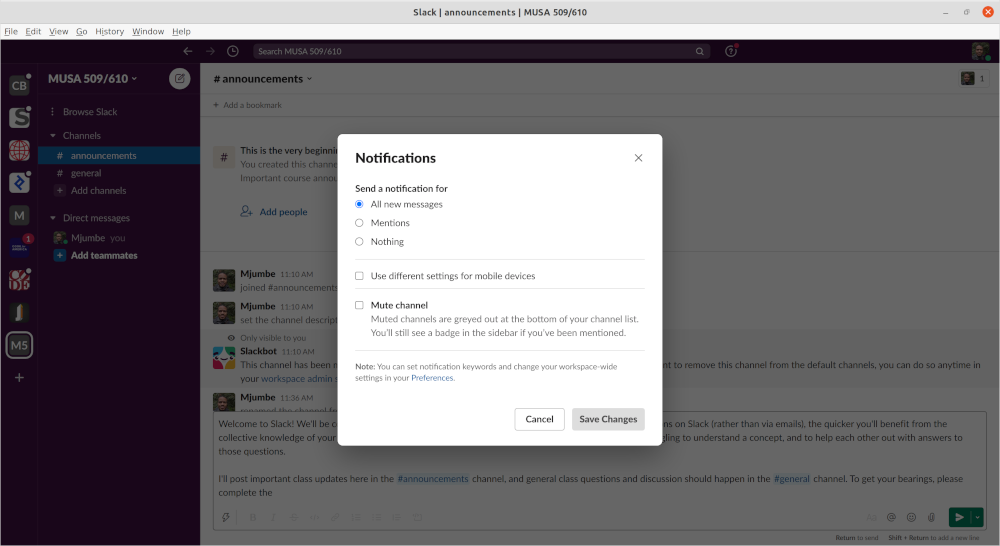

# Slack Intro

* Join the course Slack organization at https://join.slack.com/t/musa509610/signup. If you use your _design.upenn.edu_ email address you should be able to get in. If you would like to use a different address (or don't have a _design.upenn.edu_ address) please email me at mjumbe@design.upenn.edu and I will send an invitation.
* Once you have joined:
  1. Under your settings, go to **Edit profile** and include _at least_ your preferred name, and an image of you.

     

     

  2. Ensure that your **Notification** preferences are set as you would like. I suggest you start with sending notifications for _All new messages_. If we get a lot of use out of Slack, you may want to change the **#general** channel to only send notifications for _Mentions_.

     

     

  3. Send me (**Mjumbe**) a direct message saying anything (it can be as simple as "Hello").
  4. Leave a :+1: reaction on the [intro message](https://musa509610.slack.com/archives/C02CN2ZQG23/p1630519045000500) in the **#announcements** channel.

     
