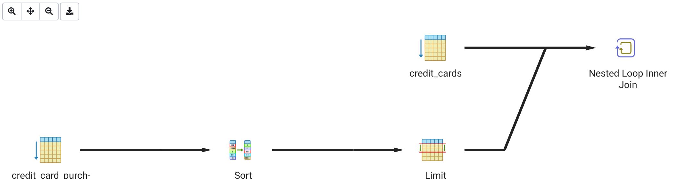
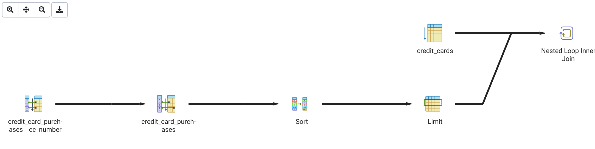

# A walkthrough of `lateral` joins

## Getting set up

To follow along with the code snippets in this walkthrough, download the following files:
* [credit_cards.csv](https://storage.googleapis.com/mjumbewu_musa_509/assn02_sample_data/credit_cards.csv)
* [purchases.csv](https://storage.googleapis.com/mjumbewu_musa_509/assn02_sample_data/purchases.csv)

In the _init_cc_tables.sql_ script, update the paths of the two files that you downloaded (right now they're set to full path of where the files were on my computer, but they need to point to where the files are on your computer). Copy the contents of the script and run in pgAdmin on your desired database (you may want to create a new database so that you can cleanly and easily destroy it later).

## Understanding the problem

**Our goal is to get the latest three purchase transactions (listed in the `credit_card_purchases` table) for each credit card (listed in the `credit_cards` table).** If there are fewer than three purchases for any credit card, then we just show all that there are. If there are no purchase for a credit card, we can just omit that card.

There are a few ways that we could do this, but PostgreSQL's `lateral` join feature provides the best option by far. The thing to understand is that in SQL it's generally easy to get some finite number of ordered records when we know what we're comparing against, but it's harder when we want to get some finite number of ordered records _with respect to some unknown number of other records_. For example, if we just wanted to get the 3 most recent transactions for the credit card number `4916261980884566`, that would be fairly simple:

_**Query 1** - 3 most recent purchases for CC number `4916261980884566`:_
```sql
select
    cc_number,
    purchase_id,
    purchase_amount,
    purchase_dt
from credit_card_purchases
where cc_number = '4916261980884566'
order by purchase_dt desc
limit 3
```

But if we want to repeat this for all of the `cc_number` values, we're out of luck. This is where `lateral` joins come in. The syntax for a later join is:

```sql
select t1.id, t2.id, ...
from first_table as t1
cross join lateral ( ... ) as t2
```

Whatever the query is that comes in the parentheses after `lateral` will be run for each row of the parent table (`first_table` in the example above). So, in our case, the parent table could be `credit_cards`, and we want our _**Query 1**_ to be run for each row of that table. So, the query that we would use is:

_**Query 2** - 3 most recent purchases for each CC number:_
```sql
select cc.cc_number, cc_pch.purchase_id, cc_pch.purchase_amount, cc_pch.purchase_dt
from credit_cards as cc
cross join lateral (
    select
        cc_number,
        purchase_id,
        purchase_amount,
        purchase_dt
    from credit_card_purchases as pch
    where pch.cc_number = cc.cc_number  -- <- That's the magic!
    order by purchase_dt desc
    limit 3
) as cc_pch;
```

The magic here is that a child query in a `lateral` join can reach outside of the parentheses to use values. Note that in the query above we're using a `cross join`. This is a common type of join with `lateral`, but is not necessary. If we want to include credit card numbers even when there are no related purchases, we can use a `left join` instead. If we do, we have to add a join condition (because only cross joins can be used without a join condition), but we can just make that condition `true` (try to puzzle out why we do that):

```sql
select cc.cc_number, cc_pch.purchase_id, cc_pch.purchase_amount, cc_pch.purchase_dt
from credit_cards as cc
left join lateral (
    select
        cc_number,
        purchase_id,
        purchase_amount,
        purchase_dt
    from credit_card_purchases as pch
    where pch.cc_number = cc.cc_number  -- <- That's the magic!
    order by purchase_dt desc
    limit 3
) as cc_pch
    on true;
```

## Optimizing the solution

The code above in _**Query 2**_ will work, but on my computer it took **two hours!** It is not necessary for this query to take that long, but we haven't given PostgreSQL any hints about how it might optimize. In our `credit_cards` table we have 100,000 records, and in the `credit_card_purchases` table we have 1,000,000 records. If we have to search through the purchases table for the latest transactions, and we have to do that for each credit card, that's a total of 100,000 * 1,000,000 = 100,000,000,000 (100 billion) individual evaluations! Computers are fast, but they can only do so much.

We can give PostgreSQL hints about where it can optimize our query in the form of indexes. In particular, any time we're using an expression to sort, filter, or join a table, we might want to consider creating an index so that PostgreSQL doesn't have to look through the entire table to find the relevant information.

Here is the query plan that PostgreSQL puts together for my query. Notice the only types of scans that we're doing are sequential scans:


In our case, we're using the `credit_card_purchases.purchase_dt` field to sort, and the `credit_card_purchases.cc_number` field to join. Both of those are good candidates for adding indexes. It doesn't hurt to add indexes on both (though I suspect we'll get the most value out of the `cc_number` index).

```sql
create index credit_card_purchases__cc_number__idx
    on credit_card_purchases
    using btree (cc_number);

create index credit_card_purchases__purchase_dt__idx
    on credit_card_purchases
    using btree (purchase_dt);
```

After applying the above indexes, my query takes about **2.5 seconds.** The query plan that PostgreSQL uses now is below. Notice that we are no longer sequential scanning through the `credit_card_purchases` table (instead we're doing a [_Bitmap Index Scan_ followed by a _Bitmap Heap Scan_](https://pganalyze.com/docs/explain/scan-nodes/bitmap-index-scan)):


## In summary...

Any time you have a task to get a finite number of ordered records from a table _`X`_ with respect to the records in some other table _`Y`_, if you're working in PostgreSQL you can take advantage of `lateral` joins. Think first about how you can retrieve the correct number of records from table _`X`_ given just one of the records of _Y_ (as in _**Query 1**_ above). Then take your query and wrap it in a parent query on table _`Y`_ (as in _**Query 2**_ above).
